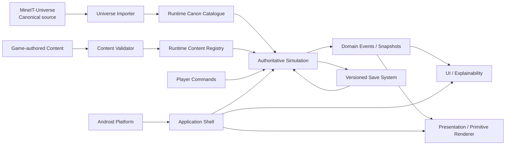
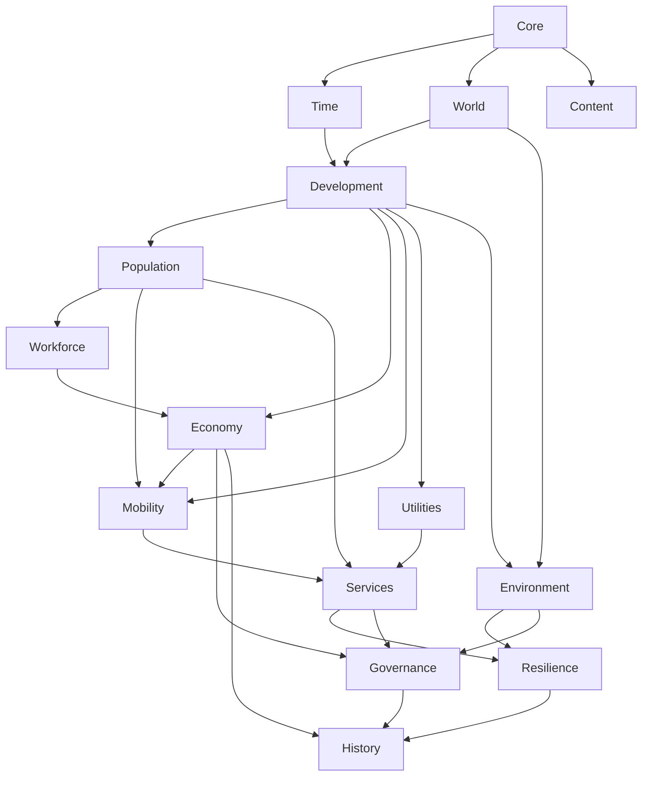

# 04 — Architecture Context and Domains

## System context



## Layer rule

Dependencies point toward authoritative domain state.

```text
Android / UI / Presentation
          ↓
Application orchestration
          ↓
Domain simulation services/systems
          ↓
Core IDs, time, maths, events, content contracts
```

Simulation assemblies never reference UI Toolkit, cameras, materials or Android APIs.

## Domain ownership

### Core

Owns:

- stable IDs;
- deterministic random streams;
- fixed/fixed-point value types;
- domain event contracts;
- error/result types;
- invariant helpers.

### Time

Owns:

- simulation timestamp;
- speed state;
- deterministic scheduler;
- event queue;
- cadence registration;
- catch-up rules.

### World

Owns:

- canonical tile identity;
- runtime chunk identity;
- terrain/land/water semantic state;
- spatial indices;
- district membership;
- spatial relevance.

### Development

Owns:

- rights of way;
- blocks;
- parcels;
- zoning;
- building lifecycle;
- construction projects.

### Population

Owns:

- citizens;
- households;
- lifecycle;
- migration;
- needs/activity plans.

### Workforce/Education

Owns:

- jobs;
- skills/qualification;
- education enrolment;
- workplace/school matching.

### Economy

Owns:

- ledgers;
- money;
- prices/rent;
- business state;
- inventory;
- industry production;
- construction market.

### Mobility

Owns:

- multimodal graph;
- trips;
- route requests/cache;
- traffic queues/flows;
- freight movement;
- transit operations.

### Utilities

Owns:

- network topology;
- source/capacity/storage;
- flow allocation;
- outages;
- priority/load shedding.

### Services

Owns:

- service demand;
- facility effective capacity;
- dispatch;
- queues;
- outcomes.

### Environment/Resilience

Owns:

- pollution/exposure fields;
- weather;
- flood/drainage;
- habitat;
- incidents;
- recovery.

### Governance

Owns:

- districts/policies;
- mandate;
- budgets/projects approval;
- technology programmes;
- scenario/progression state.

### History/Events

Owns:

- city event history;
- narrative facts;
- notable entity history;
- news input facts.

### Persistence

Owns:

- save container;
- per-domain codecs;
- migration registry;
- autosave;
- checksums;
- compatibility report.

## Domain dependency graph



Arrows show information dependencies, not permission to mutate another domain's internals.

## Cross-domain communication

Preferred mechanisms:

- immutable runtime content references;
- read-only queries;
- batched domain commands;
- domain events;
- explicit shared graph/spatial APIs.

Avoid:

- system A writing arbitrary component owned by system B;
- managed event buses allocating per entity;
- global singleton bags;
- accessing UI state from simulation.

## Command boundary

Player/UI commands are queued and applied at a deterministic simulation boundary.

Example:

```text
UI gesture
→ BuildRoadIntent
→ validation/preview
→ CommitBuildRoadCommand
→ deterministic command queue
→ World/Development mutation
→ NetworkChanged event
→ mobility/utilities invalidate local caches
→ presentation rebuild request
```

## Presentation bridge

The bridge transforms authoritative state into render-ready data.

Responsibilities:

- spawn/despawn render entities;
- LOD representation;
- interpolation;
- primitive archetype resolution;
- overlay buffers;
- selected/highlight state.

It cannot decide whether a citizen got a job, whether a road is congested or whether a building has power.

## Read models

UI should not query millions of ECS records every frame.

Create aggregated read models:

- selected entity details;
- city headline metrics;
- district summaries;
- network diagnostics;
- charts/history;
- alerts;
- overlay textures/buffers.

Read models update at appropriate cadence and expose “as of simulation time.”

## Error philosophy

Invalid authored content: fail CI.

Invalid player action: return clear validation reason.

Recoverable runtime content mismatch: compatibility screen, not crash where possible.

Invariant violation in developer builds: fail loudly with entity IDs and trace.

## Architecture tasks

- IMP-ARC-001 — Create core/domain assembly graph.
- IMP-ARC-002 — Define domain ownership document.
- IMP-ARC-003 — Implement command queue contract.
- IMP-ARC-004 — Implement domain event stream.
- IMP-ARC-005 — Implement read-model snapshot contracts.
- IMP-ARC-006 — Implement presentation bridge interface.
- IMP-ARC-007 — Add developer invariant framework.
- IMP-ARC-008 — Add structured diagnostic IDs.
- IMP-ARC-009 — Add architecture dependency test.
- IMP-ARC-010 — Prevent simulation assemblies referencing presentation/UI assemblies.

## Exit criteria

- assembly graph enforces direction;
- command -> simulation -> event -> read model path demonstrated;
- presentation can be disabled while headless simulation continues;
- deterministic test can execute without camera/UI;
- one invariant failure identifies domain/entity/time.
