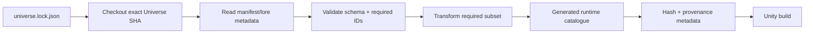

# 08 — Universe Import and Content Pipeline

## Ownership

MineIT-Universe remains canonical.

City Builder never edits canonical Universe data as part of normal game implementation.

## Lock file

Create `config/universe.lock.json`:

```json
{
  "repository": "kevvy555/MineIT-Universe",
  "commit": "<40-char SHA>",
  "schemaCompatibility": "<range/version>",
  "importerVersion": 1
}
```

The commit is explicit. Builds do not consume a moving branch head.

## Import pipeline



## Required imported content

At minimum:

- Koplin 3 planet;
- Concordia settlement;
- Koplin 3 atlas;
- atlas tile records;
- edge-continuity metadata;
- Trondonian, Zoran, Blaxmar;
- Commonwealth organisation;
- Commonwealth Credit;
- relevant world/biome/hydrology terms;
- relevant canonical materials/substances;
- referenced organisations;
- technology/lore references required by scenarios.

Do not import every Universe record “just in case” into the runtime package.

## Importer boundary

Importer knows Universe schema.

Simulation knows City Builder runtime canon schema.

This prevents hundreds of game systems binding directly to Universe JSON layout.

## Generated runtime catalogue

Generate compact, immutable structures suitable for Unity.

Example outputs:

- `canon.catalog.bytes`;
- `atlas.index.bytes`;
- `canon.provenance.json`.

Generated output includes:

- Universe SHA;
- importer version;
- content hash;
- imported stable IDs;
- warnings/errors;
- generation timestamp for diagnostics only.

Runtime gameplay never uses generation timestamp as deterministic input.

## Lore handling

Long-form lore is not copied wholesale into simulation components.

If in-game encyclopedia content needs canonical lore:

- import an approved excerpt/reference/derived entry;
- retain source path/topic metadata;
- keep gameplay tuning separate.

Canon precedence remains defined by Universe AGENTS/lore.

## CI validation

CI must fail when:

- lock SHA unavailable;
- required manifest missing;
- required canonical ID missing;
- duplicate imported ID;
- unresolved reference;
- incompatible schema;
- atlas coordinate duplicate;
- imported display/type mismatch violating adapter contract.

Warnings are reserved for optional content, not required identity.

## Local development

Supported modes:

1. exact locked checkout automatically fetched by script;
2. developer-provided local Universe path verified against expected commit;
3. explicit `--update-lock` workflow in a dedicated branch.

A dirty/unverified local Universe checkout cannot silently produce releasable generated data.

## Updating Universe

Process:

1. create `chore/update-universe-<date>`;
2. change lock SHA;
3. run importer diff;
4. report added/changed/removed relevant records;
5. run visual atlas impact report;
6. run content/reference tests;
7. inspect intentional canon changes;
8. merge lock + generated artefact update together.

## Atlas interactive geometry

Canonical atlas art is reference input, not collision geometry.

City Builder stores its own interactive reconstruction keyed by atlas tile ID:

- road anchors;
- transit anchors;
- waterways;
- landmark anchors;
- terrain controls;
- district grammar.

When source atlas changes, importer flags impacted tiles; it never rewrites a player's existing city.

## Build reproducibility

Given:

- same City Builder commit;
- same Universe lock SHA;
- same package lock;
- same generator versions;

generated runtime canon hash must match.

## Tasks

- IMP-CAN-001 — Add Universe lock schema.
- IMP-CAN-002 — Implement fetch/local-source resolver.
- IMP-CAN-003 — Implement Universe manifest loader.
- IMP-CAN-004 — Implement canonical precedence-aware validation metadata.
- IMP-CAN-005 — Implement required-ID validator.
- IMP-CAN-006 — Implement atlas importer.
- IMP-CAN-007 — Implement compact runtime catalogue writer.
- IMP-CAN-008 — Implement provenance/hash report.
- IMP-CAN-009 — Integrate importer into CI.
- IMP-CAN-010 — Add Universe update diff report.
- IMP-CAN-011 — Add tile visual-impact report.
- IMP-CAN-012 — Test deliberately broken canonical ID.

## Exit criteria

- build reports exact Universe SHA;
- runtime retains canonical IDs;
- missing required canon fails CI;
- changing display name does not create new identity;
- same inputs produce same runtime catalogue hash;
- game simulation does not parse raw Universe JSON at runtime.
